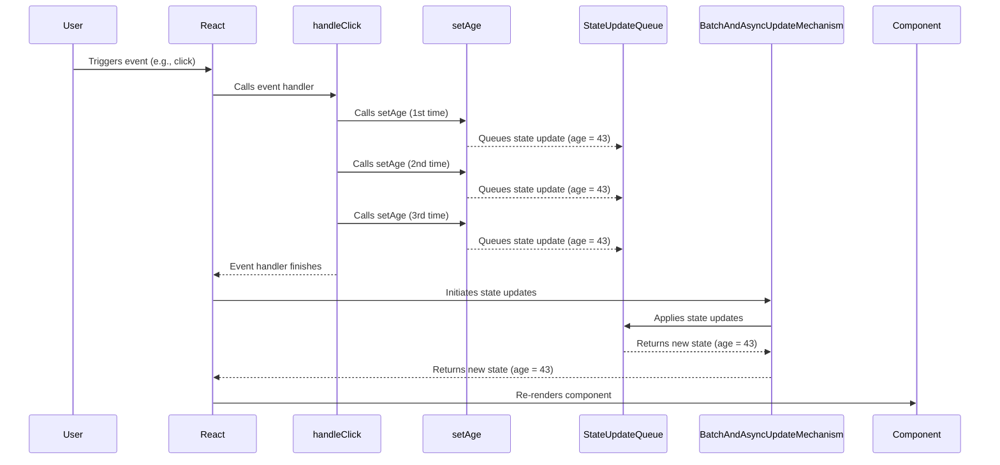
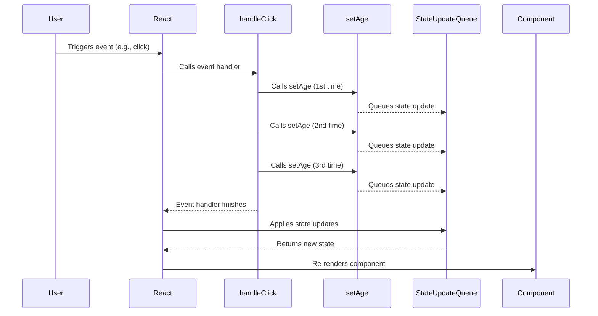

# React Hook: useState

## 两种初始化

- `useState(initialState)`
- `set` functions, like `setSomething(nextState)`

```jsx
import React, { useState } from 'react';

const initialState = () => {
    console.log('Initial state called...');
    return {
        name: 'John Doe',
        age: 25,
        likes: ['Reading', 'Swimming'],
        skills: ['React', 'Node', 'MongoDB']
    };
};

function MyComponent() {
    // 1. define a useState function state
    const [name, setName] = useState('John Doe');

    console.log('Component rendered...');

    // 2. define a useState function state
    const [userInfo, setUserInfo] = useState(initialState);

    return (
        <div>
            {/* Your component content here */}
            <h1>{name}</h1>
            <input type="text" value={name} onChange={(e) => setName(e.target.value)} />
            <button onClick={() => setUserInfo({ ...userInfo, name })}>Change Name</button>
            <h2>Name: {userInfo.name}</h2>
            <h2>Age: {userInfo.age}</h2>
            <h3>Likes: {userInfo.likes.join(', ')}</h3>
            <h3>Skills: {userInfo.skills.join(', ')}</h3>
        </div>
    );
}

export default MyComponent;
```

## 直接更新 VS 函数式更新

解释这段代码为什么输出的值都是 43？

```jsx
const [age, setAge] = useState(42);

function handleClick() {
  setAge(age + 1); // setAge(42 + 1)
  setAge(age + 1); // setAge(42 + 1)
  setAge(age + 1); // setAge(42 + 1)
}

// click button
<Button onClick={handleClick}></Button>
<p>User age is: {age}</p>
```



因为在同一个事件处理函数（如 `handleClick`）中连续调用 `setAge`，并不会立即更新 `age` 的值，而是在事件处理函数结束后，React 才会进行状态更新和重新渲染。

所以，在 `handleClick` 中连续调用三次 `setAge`，每次调用时的 `age` 值都是 42，所以值都是 43。即使调用了三次，age 也只会更新一次。

从 React 状态更新的角度分析，因为 React 中状态更新可能是异步的，在调用 `setAge` 时，不会立即更新 `age` 的值，会延迟稍后执行，这种方式也被称为批量更新（batched updates）。

批量更新的目的是为了优化性能，如果每次状态更新都立即触发重新渲染，那么在一个事件处理函数中连续多次状态更新就会导致多次不必要的重新渲染。

### 如何避免这种问题，正确的更新呢？

给 `setAge` 传递一个函数，这个函数接收当前状态作为参数，并返回新的状态，`preAge`为最新状态的值。

```jsx
function handleClick() {
  setAge(prevAge => prevAge + 1);
  setAge(prevAge => prevAge + 1);
  setAge(prevAge => prevAge + 1);
}
```



当新的状态依赖前一个状态时，建议使用函数式更新，这样确保更新的准确性，特别是在并发模式下。

## 其他几种更新

### 对象与数组

需要创建新引用，而不是直接修改原状态，是因为 React 依赖于状态的不可变性来确定什么时候重新渲染组件，如果直接修改状态，React 可能无法正确检测到状态的变化，导致组件不更新。

考虑一下代码：

```jsx
const [items, setItems] = useState(['Apple', 'Banana', 'Cherry']);

// 直接修改状态
items.push('Durian');
setItems(items);
```

正确的更新方式：

```jsx
const [items, setItems] = useState(['Apple', 'Banana', 'Cherry']);

// 创建一个新的数组
const newItems = [...items, 'Durian'];
setItems(newItems);
```

### 函数

学习资料中提到可以用下面方式存储并更新函数

```jsx
const [fn, setFn] = useState(() => someFunction);

function handleClick() {
  setFn(() => someOtherFunction);
}
```

但需要注意的是，当调用 setFn(() => someOtherFunction) 时，实际上是在使用函数式更新。这代表 React 会将 () ⇒ someOtherFunction 这个函数作为一个 ”更新函数“，并将当前状态”fn“作为参数传递给它（prevFn），然后，这个”更新函数“的返回值用作新的状态，而这个新的状态恰好是一个函数。在这整个过程中，”更新函数“并没有使用它的参数（prevFn）。

如果新的状态需要依赖旧状态，可以像下面使用：

```jsx
setFn(prevFn => (...args) => {
  prevFn(...args);
  someOtherFunction(...args);
});
```

我会更喜欢将函数包装到一个对象中，再把对象存储到状态中，这样会更好理解和使用。

```jsx
const [myFunction, setMyFunction] = useState({ func: () => console.log('Hello, world!') });
```