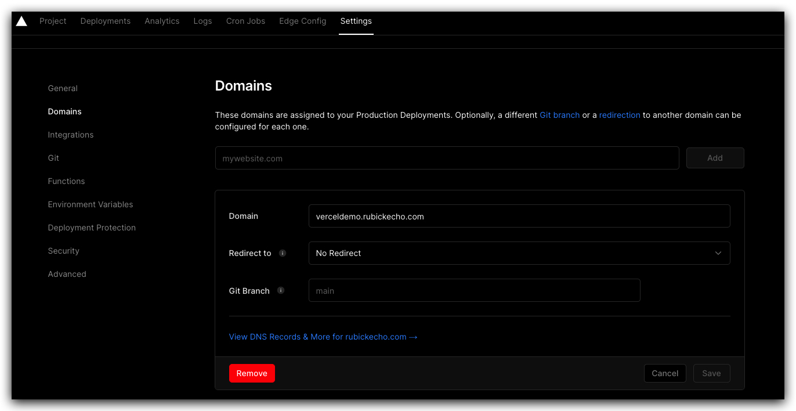
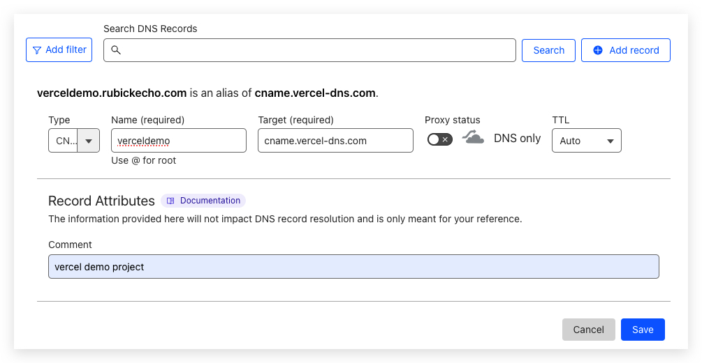
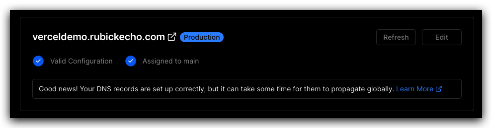

# How Vercel configures Domain

## 具体步骤
1. 登录 Vercel 帐户，并进入应用程序。
2. 点击应用程序右上角的 `Settings` 选项。
3. 在 `Settings` 页面中，点击 `Domains` 选项。
4. 点击 `Add` 按钮，输入域名。
    
5. 根据提示设置 DNS 解析（这里以 cloudflare 举例）。
    
6. 等待 DNS 设置更新，这可能需要一些时间。
7. 回到 Vercel 的 `Domains` 页面，点击域名，`Check DNS Configuration`。
8.  如果 DNS 设置正确，就绑定成功。
    

## 参考资料

- [Assigning a Custom Domain](https://vercel.com/docs/concepts/get-started/assign-domain)